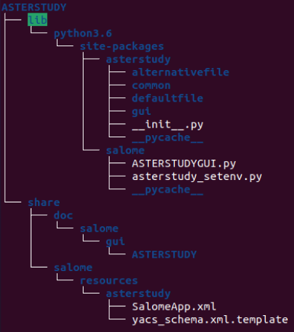
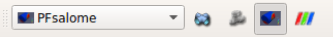
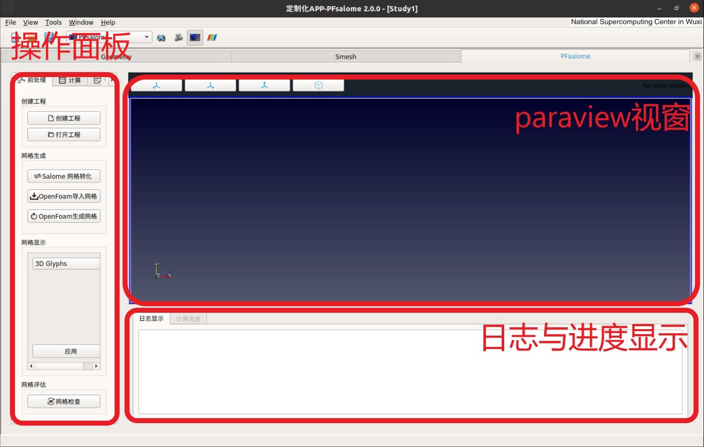
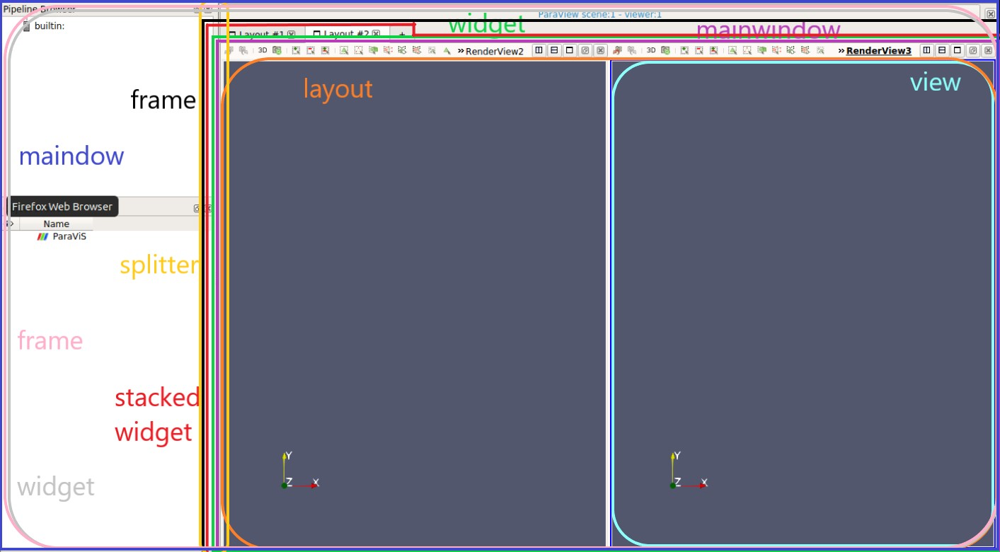

## 使用方法:
1. 先下载[Salome](https://www.salome-platform.org/downloads/previous-versions/salome-v9.4) (版本最好为9.4,其他版本尚未测试)
2. 再下载[Pfsalome](https://github.com/leoxiaoyuan/PFsalome)，然后解压到salome模块文件夹中(路径示例 Salome-9.4/SALOME-9.4.0-UB18.04-SRC/BINARIES-UB18.04)
3. 修改salome启动文件 (可修改salome或mesa_salome文件).这里我们以修改salome文件为例.
```console
    $ vim salome
```
找到'#PRODUCT environment'行并在<font color=red>'SMESH'</font> 之后插入<font color=red>'ASTERSTUDY'</font>. 接着我们需要通过在<font color=red>'#[all products]'</font> 之后添加如下代码来配置PFsalome的环境变量(备注:这些行应该在启动salome和解析命令行参数的代码之前添加)
```
#[ASTERSTUDY]
context.setVariable(r"ASTERSTUDY_ROOT_DIR", out_dir_Path + r"/BINARIES-UB18.04/ASTERSTUDY", overwrite=True)
```
4. 运行salome或mesa_salome

## 说明文档:

PFsalome是作为一个轻量化库被集成到salome中，具体文件结构如下：
<div align=center></div>

1. 重要文件的功能介绍
    - defaultfile和alternativefile文件夹中存放了pimplefoam运行所需的配置文件模板
    - common文件夹中存放了一些常用的函数
    - gui文件夹中存放了gui界面设计的程序
    - SalomeApp.xml中可更改模块名称，图标，版本等信息
2. 界面的修改和内容扩充
    - 载入界面的修改
        - 转到Salome-9.4/SALOME-9.4.0-UB18.04-SRC/BINARIES-UB18.04/SALOME/share/salome/resources/salome
        - 通过以下命令将qm文件转化成ts文件
            >lupdate qm文件名 -ts ts文件名
        - 修改关键词
        - 最后转回qm格式
            >lrelease ts文件名 -qm qm文件名
    - 模块栏的修改</br><div align=center></div>
        - 通过在启动脚本salome中注释掉相应模块，可实现模块的增加或删减
        - 通过在SalomeApp.xml中更改相应信息实现自定义模块的名称，图标和版本信息的更换
    - 页面的增删或更改
        页面脚本位于Salome-9.4/SALOME-9.4.0-UB18.04-SRC/BINARIES-UB18.04/ASTERSTUDY/lib/python3.6/site-packages/asterstudy/gui中,具体关系如下表格：
        |文件或文件夹名|对应的界面区域|功能|
        |----|----|----|
        |workspace.py|主页面|产生PFsalome模块主页面布局|
        |Mesh_transfer|网格转化弹窗|salome_mesh_tran.py-->网格转换设置界面</br>mesh_transfer.sh-->执行网格转换命令脚本|
        |Mesh_generation|网格生成弹窗|mesh_generationUi.py-->网格生成设置界面</br>mesh_generate.sh-->执行网格生成命令脚本|
        |Checkmesh|网格检擦按钮对应功能|mesh_check.sh-->执行网格检查命令脚本|
        |Material|材料编辑弹窗|MaterialManager.py-->材料管理界面</br>MaterialEdit.py-->材料编辑界面|
        |Model|模型选择弹窗|ModelManager.py-->模型选择界面|
        |BC|边界条件设置弹窗|boundaryform.py-->边界类型管理界面</br>boundaryeditUI.py-->边界类型边界弹窗</br>lookforboundarycondition.py-->查找boundary文件中的各边界名称</br>|
        |Field|场设置弹窗|FieldsettingUi.py-->场设置界面|
        |Scheme|离散方案设置弹窗|SchemesettingUi.py-->离散方案设置界面</br>CollapsibleBox.py-->带动画的折叠菜单|
        |Solver|求解器设置弹窗|SolverManUi.ui-->求解器管理界面</br>SolvereditUi.py-->求解器编辑界面|
        |Computing_control|计算参数设置弹窗|Computingcontrol.py-->计算参数设置界面|
        |Run|开始计算按钮对应功能|run.sh-->开始计算shell脚本|
        |其他文件或文件夹|辅助，测试用||
        - 主页面的布局及修改方法
        
        主页面可分为三部分，操作面板，paraview视窗及日志与进度显示.主页面可分为三部分，操作面板，paraview视窗及日志与进度显示。主页面的布局和控件可在gui/workspace中修改，workspace脚本以对各部分代码详细注释。操作面板分为三个标签页，其中内容可在gui/Workspace/workspace_ui中修改,各控件的对应关系也可大致通过workspace.ui查看。
        - 各弹窗界面的修改方法

        由于大量控件需要动态添加，所以界面没有与功能分离。想要找到各控件的对应关系，可通过打印弹窗脚本中普遍存在的key_list与value_list找到对应的控件
    - Paravis的gui结构

        
        
        <font color='#33CCFF'>view</font>-->pvsimple.getviews()

        <font color=purple>mainwindow</font> 的获取-->pvsimple.getviewwidget()