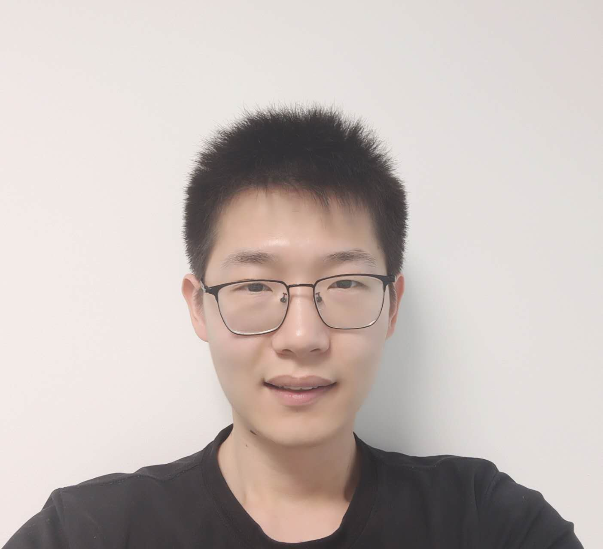

# A happy programmer

Hi! My name is Zeyuan. I have created a few interesting projects using Unix, Python, Fortran and JavaScript. 

The overall aim of my research is to investigate and develop the next generation of CAE softwares by using Machine learning. I'd be very honored if some porjects can help you!

<!--   -->

[GitHub](<https://github.com/leoxiaoyuan?tab=repositories>)
[About ME](?id=Publications)

